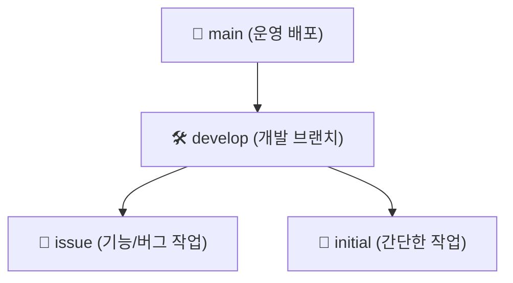
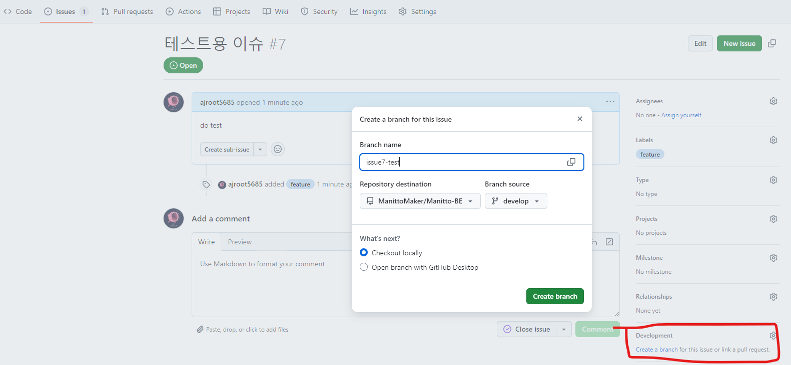

# Manitto-BE

## ✨ Husky & Commitlint

Git 훅을 이용해 커밋 메세지 형식을 강제하여 일관성을 유지합니다.

### 설치

```
npm install
```

### 커밋 메세지 규칙

- `Type(필수)`: Commit의 종류. commit을 할 때, type에 상응하는 이모지가 자동으로 붙습니다.
- `Scope(선택)`: Commit의 범위. 기능, 함수, 페이지, API 등 자유롭게 선택할 수 있습니다.
- `Subject(필수)`: Commit의 제목. 되도록 간결하게 작성하고, 명사형 어미로 끝나도록 합니다.
- `Body(선택)`: Commit의 내용. 어떤 이유로, 어떻게 변경했는지 작성합니다.
- `Footer(선택)`: Commit의 추가 정보. 이슈 트래킹이나 참고 사항을 기록합니다.

### 헤더 예시

```
<type>(optional scope): <subject>

✨ Feat(login/SignUp): 회원가입 기능 추가
🐛 Fix(login): 로그인 기능 수정
⭐️ Style: 코드 포맷 변경
♻️ Refactor(SignUp): 회원 가입 로직 개선
📁 File: 이미지 파일 추가
✅ Test: 테스트 코드 추가
📝 Docs: README.md 업데이트
🔥 Remove: 사용하지 않는 파일 제거
💚 Ci: 자동 배포 스크립트 변동
🔖 Release: 릴리즈 버전 1.0.3
🔧 Chore: 설정파일 수정
```

### 메세지 구조

```
<type>(optional scope): <subject>

[optional body]

[optional footer(s)]
```

## 🌿 Branch Strategy

이 프로젝트는 **이슈 템플릿을 기반으로 작업**합니다.  
브랜치는 크게 **main, develop, issue, initial** 로 나뉩니다.



### main

- 운영 서버에 배포 가능한 브랜치입니다.
- 안정적인 코드만 포함됩니다.

### develop

- 개발 브랜치로, 모든 기능이 이곳에서 통합됩니다.
- 직접 수정하지 않고, issue 또는 initial 브랜치를 통해 머지됩니다.

### issue

- 이슈 템플릿을 기반으로 작업하는 브랜치입니다.
- commitlint와 연동되어 자동으로 이슈와 연결됩니다.

✅ 브랜치 네이밍 규칙

```
issue{이슈번호}-{type}-{이름}
```

📌 예시

```
issue42-feature-login
issue55-fix-login-and-signup
```

### initial

- 이슈가 필요 없는 간단한 추가/수정/문서 작업을 위한 브랜치입니다.
- 개발자의 이니셜을 브랜치 이름으로 사용합니다.

✅ 브랜치 네이밍 규칙

```
{initial}
```

📌 예시

```
jg
```

### issue 브랜치 생명주기

issue 페이지에서 각 커밋을 가독성 좋게 관리하기 위해 다음 규칙으로 제한합니다.

1. 깃허브에서 이슈를 생성합니다
2. Development에서 새로운 브랜치를 생성합니다
   
3. 작업 후 원격브랜치로 push합니다
4. Github에서 merge를 수행합니다

## 📝 Swagger API DOCS 명세서

로컬 : http://localhost:8080/swagger-ui/index.html
운영 : {미배포}/swagger-ui/index.html